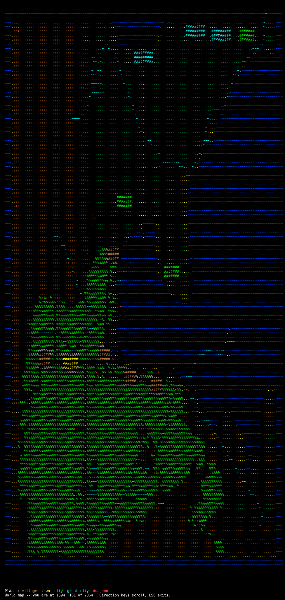
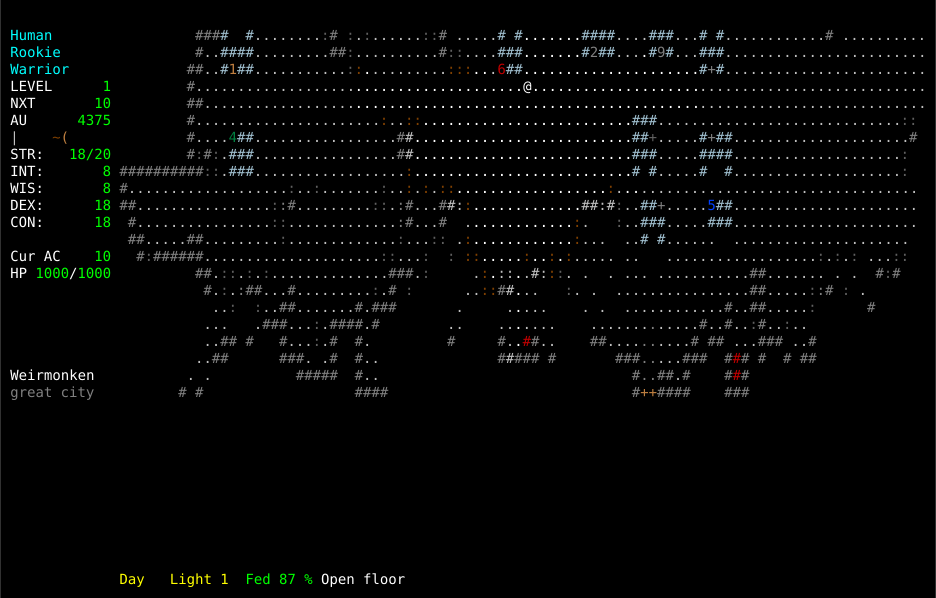
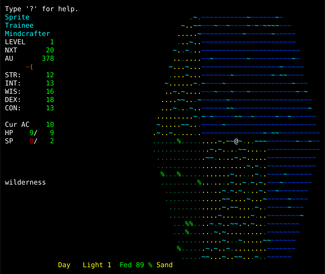
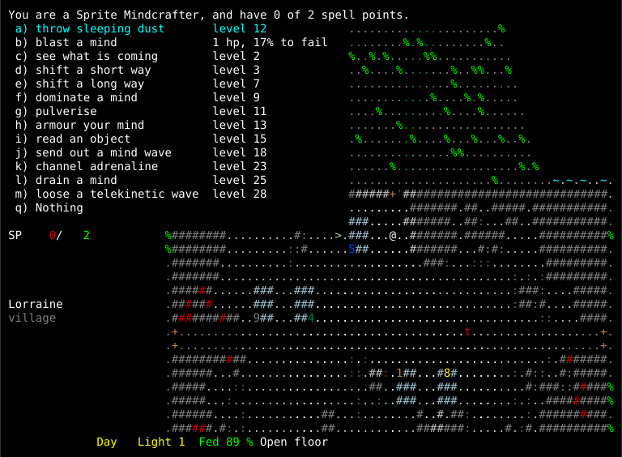
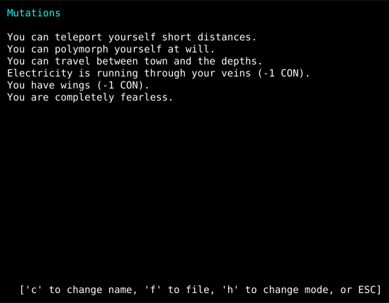
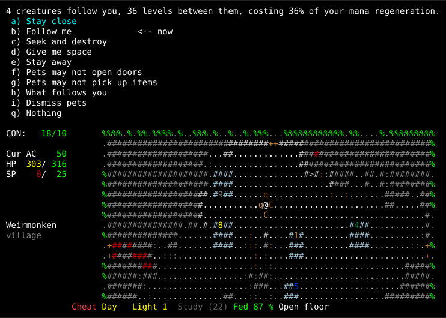

===========
Screenshots
===========

These are captured from the running game, not drawn. ZangbandTK renders as
characters with colour attributes, so what you see below *is* the screen — every
glyph in the position and colour the game put it in, at any size you care to
zoom to.

The world
=========

The whole of one world, seen from the overhead map. A game generates this from a
single seed and it comes back the same every time (:doc:`wilderness`).

         sea, coast, forest, mountain and open country, with towns and dungeon
         mouths marked.
   :width: 100%

Blue is sea and light blue the shallows you can wade. Green is grassland, light
green forest, umber the mountains that are impassable. The ``@`` is the character
and ``>`` a dungeon mouth. The towns show as blocks rather than points, because
they are: a great city is 132 grids across, which is most of nine blocks.

This is the map with everything known. In play you see only what you have been
near — the map fills in behind you as you walk, and that is most of what the
:doc:`magetower <towns>` is for.

The surface
===========

Not a town level with a wilderness somewhere else. The same map, scrolling as you
walk, with the town standing in it.

         visible through the gate, roads leading away, and open country around.
   :width: 100%

The numbers are shops and the ``+`` symbols are services — an inn, a healer, a
magesmith. The road leaves by the gate and goes somewhere: every town and every
dungeon mouth in the world is on the network, which is how you find the next one.

Walk far enough in any direction and the window scrolls; walk far enough west and
you run out of land, then out of world.

The coast
=========

Walk far enough west and the land runs out.

         view, the waterline running down the middle and grassland on the
         right, the character standing on the shore.

The sea is real terrain, not a wall drawn at the edge of the map. Shallow water
can be waded; deep water can be waded too, but not while heavily laden — the game
asks before it lets you try. The world has a coast on every side, because the
fractal that makes the land is bounded by ocean rather than by an invisible
barrier.

The ``N`` glyphs out on the water are fish, and they are the reason to think
twice about wading. They cannot come ashore, so a character who stays on the sand
is in no danger from them at all — but the sea is never tame, whatever the law is
like on the land beside it.

What a character can do
=======================

A Sprite Mindcrafter at the start of its career, with the power list open on
``N``. Everything on it is on one key, and none of it came out of a book.

         twelve psionic ones with the level each arrives at and the chance of
         failing, over a view of the wilderness outside a village.
   :width: 100%

The first entry is the race's, not the class's — a Sprite throws sleeping dust,
and will be able to at level 12. The other twelve are the Mindcrafter's psionics
(:ref:`Psionics <psionics>`), listed with the level each arrives at, and for the
ones already available, the cost and the chance of failing. This character is
level 1, so only *blast a mind* can be used at all.

It says ``1 hp`` rather than ``1 sp`` because this character has spent its mana
and has not slept since. A power takes spell points where there are any and hit
points where there are not, and the menu tells you which before you commit —
which for a Warrior or a Monk, who have no mana at all, is always blood.

The sidebar names the place and its size, *Lorraine, village*, and the status
line says *Day*. Both are ZangbandTK's: Angband has neither a world for a town
to sit in nor a time of day for it to be.

What chaos has made of it
=========================

The third page of the character sheet — press ``C``, then ``h`` twice. Six
mutations on one character, which is a great many; most characters who have any
have one or two.

         description - short-range teleportation, polymorph, travel between town
         and the depths, electricity in the veins, wings, and fearlessness.
   :width: 100%

None of these was chosen. Mutations arrive from a Chaos-Warrior's patron, from a
polymorph, from a chaos attack, or from simply being a Beastman, and they cannot
be taken off the way a ring can. The first three are powers, invoked from the
same list as racial and class powers; the last three are simply true of the
character.

Two of them charge for what they give: electricity in the veins and wings each
cost a point of constitution, and the page says so. **A mutation is rarely only
what it is called** — the Zangband spoiler gives the headline of each and stops,
and the headline is generally the good half. See :doc:`mutations`.

This page is ZangbandTK's; Angband has no mechanism a mutation could be built
on. Until it existed, the only way to see the passive ones was to write a
character dump to a file and read it.

What fights for you
===================

Four pets — the number that follows you down a staircase — and the menu that
commands them, on ``P``.

         distance orders with "Follow me" marked as current, two switches and
         two actions, above a character with two dogs and two bears standing
         around it.
   :width: 100%

The line above the menu is the whole of pet balance in one sentence: *4
creatures follow you, 36 levels between them, costing 36% of your mana
regeneration*. It is charged on the **sum** of their levels, not the count, and
only past a free allowance that grows with your character — so the third animal
can cost more than the two before it put together.

The orders are a policy rather than instructions to an individual. Every pet
follows the same one, it survives a save, and it applies to pets you have not
acquired yet.

**Nothing on the map marks them as yours**, and that is deliberate. The two
``C`` and two ``q`` beside the ``@`` are drawn exactly as they would be if they
were about to eat you. A colour was considered and rejected: the glyph already
carries three rules — multi-hued, purple uniques, shapechangers — and a fourth
would lose to all of them. Look at one (``l``) and it says *pet* before its
health; the monster list (``[``) counts them, so a row reads *4 kobolds (2
pets)*, which is the question you actually have before firing into a crowd.

The **Cheat** marker in red at the bottom is not a bug in the picture. These
captures use the debug commands to set the scene, and any character that has
touched them carries that marker for as long as it exists — see
:doc:`the cheating options <option>`.

How these were made
===================

With the game's own renderer, driven headlessly. The test front end writes every
character, position and colour the game draws; a small script replays that into a
grid and emits SVG using Angband's own palette. A few of the debug commands set
the scene — *Know every place* to fill the map in, *Mutations* to give the
character the six on its sheet — and a larger terminal than a player would
normally use, so the whole world fits in one frame.

That means these cannot drift from the game. They are not screenshots of a build
somebody had lying about; regenerating them runs the current code.

Still to come
=============

**The bestiary**, showing the monsters Angband does not have — the capture can
reach the knowledge browser but not yet scroll it to a useful page. **A vampiric
or chaotic weapon** discharging, since those mechanics have no Angband
equivalent. **A Chaos-Warrior's patron** rewarding or punishing it on a level
gained. The last two need a fight and a level-up staged, which the harness cannot
do yet.
